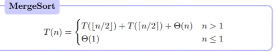

# Dividi et Impera

Il paradigma <em>Divide et Impera</em> consiste nella risoluzione ricorsiva di un problema, applicando 
tre passi a ogni livello di ricorsione:

- <b>Divide:</b> passo che divide il problema in un certo numero di sottoproblemi, che sono istanze 
più piccole dello stesso problema.

- <b>Impera:</b> i sottoproblemi vengono risolti in modo ricorsivo, fino a quando i sottoproblemi non avranno
una dimensione sufficentemente piccola, dove vengono risolti direttamente.

- <b>Combina:</b> le soluzioni dei sottoproblemi vengono combinate per generare la soluzione 
del problema originale.

## Ricorrenza 

La ricorrenza van mano nella mano con il paradigma divide et impera, in quanto ci offre un modo 
naturale per caratterizzare i tempi di esecuzione degli algoritmi divide et impera. Una <b><em>ricorrenza</em></b>
è un equazione o disequazione che descrive una funzione in termini del suo valore con input più piccoli.

Esempio di equazione di ricorrenza di merge sort:

L'obiettivo però è quello di ottenere, quando possibile, una <b>funzione chiusa</b>
che rappresenti la classe di complssità della funzione.

Quindi come si possono risolvere le ricorrenze:

- metodo di sostituzione 
- metodo dell'albero di ricorsione
- metodo dell'esperto
