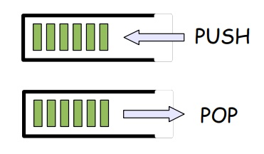

# Stack (o pila in italiano)

Lo stack (o pila) è un tipo di dato astratto che viene usato in diversi contesti 
per riferirsi a strutture dati, le cui modalità d'accesso ai dati in essa contenuti
seguono una modalità LIFO (Last In First Out), ovvero tale per cui i dati
vengono estratti (letti) in ordine rigorosamente inverso rispetto a quello in cui 
sono stati inseriti (scritti).



## Specifica

Le operazioni basilari e gli attributi che una stack possiede sono:

```text

boolean is_empty()
# restituisce true se la pila è vuot

push(Item v)
# inserisce v in cima alla pila

Item pop()
# estrae l'elemento in cima alla pila e lo restituisce al chiamante

top 
# attributo che è l'indice dell'elemento inserito più recente
```

## Possibili implementazioni

### Liste bidirezionali

### Array 