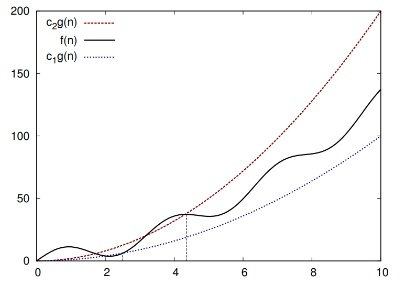
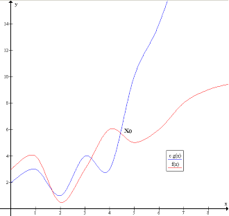
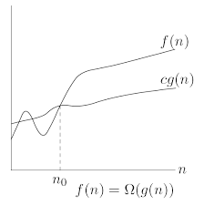

# Algoritmi e Strutture dati in Python 

Ecco finalmente la guida di algoritmi e strutture dati in <b>ptyhon!</b>

## Folder Structure

Tutte le implementazioni degli algoritmi sono nella cartella <b>Algorithms</b>, mentre le implementazioni della strutture dai sono nel cartella <b>Data Strucutres</b>.
All'interno di ognuna di queste cartelle sia gli algoritmi che le strutture dati sono raggruppate ognuno in una cartelle che li rappresenta.

<br/>

Per testare la correttezza degli algoritmi e strutture dati codificati, ho creato la cartella pytest
dove ho effetuato gli unit test ( ovviamente il framework utilizzato è pytest)


Mentre nella cartella resouces contienete tutte le immagini che ho utilizzato nei README

```
.
├── README.md
├── .gitignore
├── Algorithms
├── pytest
├── resources
└── Data Structures
```

## Strutture Dati

`B` - Beginner, `A` - Advanced

* `B` [Linked List](Data_Structures/linkedList/linkedList.py)
* `B` [Double Linked List](Data_Structures/linkedList/doubleLinkedList.py)
* `B` [Circular Double Linked List](Data_Structures/linkedList/circularDoubleLinkedList.py)
* `B` [Queue](Data_Structures/coda/coda_array_monodimensionale.py) - versione con array monodimesionale
* `B` [Queue](Data_Structures/coda/coda_array_circolare.py) - versione con array circolare
* `B` [Stack](Data_Structures/stack/stack.py)
* `B` [Heap](Data_Structures/heap/heap.py) - max and min heap versions

## Algoritmi

`B` - Beginner, `A` - Advanced

### Algoritmi per argomento

* **Sorting**
  * `B` [Bubble Sort](Algorithms/SortingAlgorithms/bubbleSort.py)
  * `B` [Selection Sort](Algorithms/SortingAlgorithms/selectionSort.py)
  * `B` [Insertion Sort](Algorithms/SortingAlgorithms/insertionSort.py)
  * `B` [Heap Sort](Data_Structures)
  * `B` [Merge Sort](Algorithms/SortingAlgorithms/mergeSort.py)
  * `B` [Quicksort](Algorithms/SortingAlgorithms/quickSort.py) - versione normale e anche la versione randomizzata
  * `B` [Counting Sort](Algorithms/SortingAlgorithms/countingSort.py)

* **Sets**
  * `B` [Maximum Subarray](Algorithms/DividiEtImpera/max-subarray-recursive.py) - versione ricorsiva
  * `A` [Maxium Subarray](Algorithms/DynamicProgramming/max-subarray-iterative.py) - versione iterativa
  

* **Searching**
    * `B` [Binary Search/ ricerca dicotomica](Algorithms/SearchingAlgorithms/binarySearch.py)
    * `B` [Linear Search/ ricerca sequenziale](Algorithms/SearchingAlgorithms/deterministicSearch.py)
    * `B` [Jump Search](Algorithms/SearchingAlgorithms/jumpSearch.py)
    * `B` [Interpolation Search](Algorithms/SearchingAlgorithms/interpolationSearch.py)
    * `B` [Random Search](Algorithms/SearchingAlgorithms/randomSearch.py)
    * `B` [Scramble Search](Algorithms/SearchingAlgorithms/scambleSearch.py)
    
### Algoritmi per paradigma

* **Forza Bruta**
* **Algoritmi Golosi**
* **Dividi et Impera**
* **Programmazione Dinamica**
* **Backtraking**
    
## Nozioni Basilari

Dato che per risolvere un determinato problemo molto spesso esistono molteplici algoritmi risolutori, 
il problema che si pone è quello di riuscire a trovare un algoritmo corretto in modo tale da 
portelo confrontare con un altro algoritmo anch'esso corretto e poter decidere quale sia il
"miglore" per risolvere lo stesso problema.

<br/>

Per fare ciò c'è bisogno di introdurre un concetto basilare che rigurda lo studio degli algoritmi cioè:
<b>la complessità computazionale</b>

### Complessità Computazionale

La complessità computazionale è lo studio della quantità di risorse (memoria e tempo di 
calcolo) necessari a un certo algoritmo per risolvere un problema dato. 

<br/>

Quindi teoricamente per ogni input bisognerebbe studiare quello che è il tempo di esecuzione di un algoritmo,
ma i teorici dell’informatica hanno introdotto delle notazioni che permettono di semplificare 
la rappresentazione della complessità computazionale di un algoritmo. 

<br/>

Infatti hanno notato che il fattore determinante che ci permette di scegliere l'algoritmo migliore è 
 il suo <b>tasso di crescita</b>. Per <b>tasso di crescita</b> si intende la velocità con cui cresce il tempo 
di esecuzione all'aumentare della dimensione dell'input <em>al limite</em>, quando la dimensione dell'input cresce senza 
limitazioni. Questo si chiama anche studiare l'efficenza <b>asintotica</b> degli algoritmi.

<br/>

Le notazioni che si usano per descrivere il tempo di esecuzione asintotico sono definite in 
termini di funzioni il cui dominio è l'insieme dei numeri naturali. Tali notazioni sono comode per descrivere la funzione
<em>T(n)</em>, tempo di esecuzione dell'algoritmo, che di solito è definita soltanto con dimensioni
intere dell'input.

### Notazione Θ

Per una data funzione <em>g(n)</em>, indichiamo con Θ(<em>g(n)</em>) <em>l'insieme delle funzioni</em>

<br/>

Θ(<em>g(n)</em>) = { <em>f(n)</em> : esistono delle costanti positive c<sub>1</sub>, c<sub>2</sub> e n<sub>0</sub> tali che
                    0 ≤ c<sub>1</sub>g(n) ≤ f(n) ≤ c<sub>2</sub>g(n) per ogni <em>n</em>  ≥ n<sub>0</sub> }

Graficamente succede questo:



<em>g(n)</em> è un <b>limite asintoticamente stretto</b> per <em>f(n)</em>

### Notazione O

Per una data funzione <em>g(n)</em>, indichiamo con O(<em>g(n)</em>) <em>l'insieme delle funzioni</em>

<br/>

O(<em>g(n)</em>) = {
                    <em>f(n)</em> : esistono delle costanti positive c e n<sub>0</sub> tali che
                    0 ≤ f(n) ≤ cg(n) per ogni <em>n</em>  ≥ n<sub>0</sub> 
                    }

Graficamente succede questo:



<em>g(n)</em> è un <b>limite asintoticamente superiore (stretto)</b> per <em>f(n)</em>

### Notazione Ω

Per una data funzione <em>g(n)</em>, indichiamo con Ω(<em>g(n)</em>) <em>l'insieme delle funzioni</em>

<br/>

Ω(<em>g(n)</em>) = { <em>f(n)</em> : esistono delle costanti positive c e n<sub>0</sub> tali che
                    0 ≤ cg(n) ≤ f(n) per ogni <em>n</em>  ≥ n<sub>0</sub> }

Graficamente succede questo:




<em>g(n)</em> è un <b>limite asintoticamente inferiore (stretto)</b> per <em>f(n)</em>

### Contribuizione

Si prega di leggere CONTRIBUTING.md per i dettagli sul codice di condotta e il processo di invio delle richieste pull.